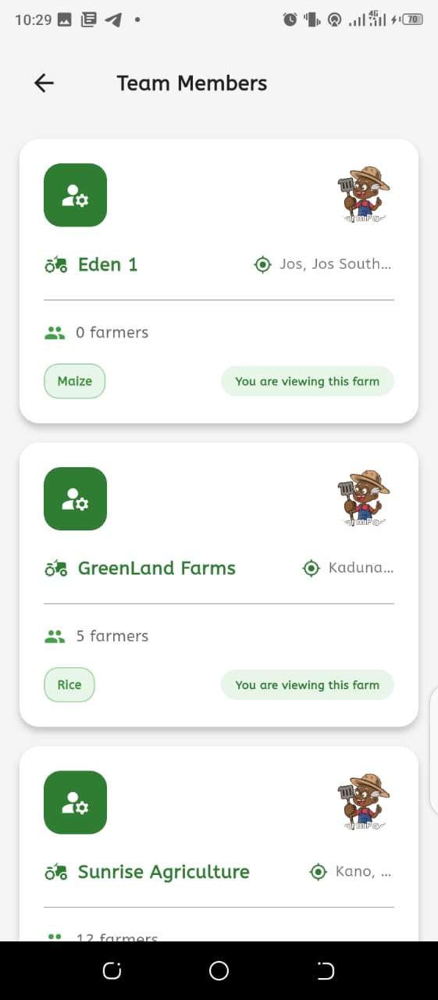
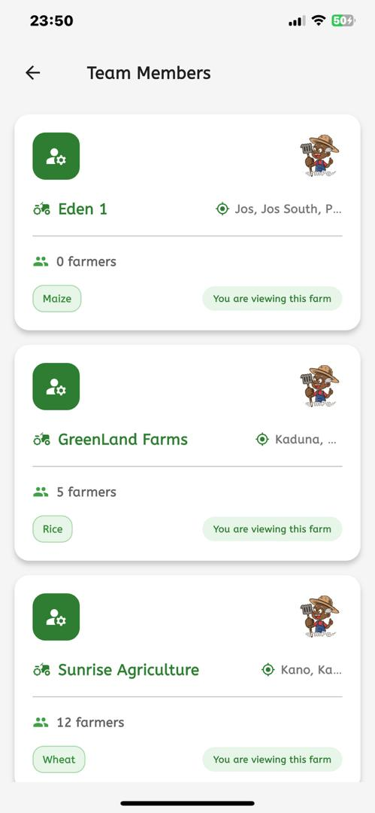

#  FarmPadi – AgriFi Flutter  Task

This Flutter project is a demo of a reusable `FarmInfoCard` widget. The card displays farm details with clean UI and responsive layout.

---

## Screenshot
| Home Screen android | Home Screen ios |
|:-:|   :-:|
|  |  |


## Platform Compatibility
  - **Android**
  - **iOS**


## PROJECT STRUCTURE

```
lib/
├── main.dart
├── widgets/
│   └── farm_info_card.dart

```


---

## DEMO VIDEO
You can see a Demo video [Here](https://youtube.com/shorts/wTXEJS-veAg?feature=share)


## How to Run

Follow the steps below to run the project locally:

```bash
git clone https://github.com/DevGR8T/FarmPadi_task.git
cd FarmPadi_task/farm_padi
flutter pub get
flutter run

